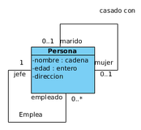

# UML

UML (Unified Modeling Language o Lenguaje Unificado de Modelado) es un conjunto de herramientas que permite modelar, construir y documentar los elementos que forman un sistema software orientado a objetos. Se ha convertido en el estándar de facto de la industria, debido a que ha sido concebido por los autores de los tres métodos más usados de orientación a objetos: Grady Booch, Ivar Jacobson y Jim Rumbaugh, de hecho las raíces técnicas de UML son:

+ OMT - Object Modeling Technique (Rumbaugh et al.)
+ Método-Booch (G. Booch)
+ OOSE - Object-Oriented Software Engineering (I. Jacobson)

¿Porqué es útil modelar?

+ Porque permite utilizar un lenguaje común que facilita la comunicación entre el equipo de desarrollo.
+ Con UML podemos documentar todos los artefactos de un proceso de desarrollo (requisitos, arquitectura, pruebas, versiones,...) por lo que se dispone de documentación que trasciende al proyecto.
+ Hay estructuras que trascienden lo representable en un lenguaje de programación, como las que hacen referencia a la arquitectura del sistema, utilizando estas tecnologías podemos incluso indicar qué módulos de software vamos a desarrollar y sus relaciones, o en qué nodos hardware se ejecutarán cuando trabajamos con sistemas distribuidos.
+ Permite especificar todas las decisiones de análisis, diseño e implementación, construyéndose modelos precisos, no ambiguos y completos.

> UML permite a los desarrolladores y desarrolladoras visualizar el producto de su trabajo en esquemas o diagramas estandarizados denominados modelos que representan el sistema desde diferentes perspectivas.

**Modelo**

Representación gráfica o esquemática de una realidad, sirve para organizar y comunicar de forma clara los elementos que involucran un todo. Esquema teórico de un sistema o de una realidad compleja que se elabora para facilitar su comprensión y el estudio de su comportamiento.

## Tipos de diagramas

UML define un sistema como una colección de modelos que describen sus diferentes perspectivas. Los modelos se implementan en una serie de diagramas que son representaciones gráficas de una colección de elementos de modelado, a menudo dibujado como un grafo conexo de arcos (relaciones) y vértices (otros elementos del modelo).

Un diagramas UML se compone de cuatro tipos de elementos:

+ **Estructuras:** Son los nodos del grafo y definen el tipo de diagrama.
+ **Relaciones:** Son los arcos del grafo que se establecen entre los elementos estructurales.
+ **Notas:** Se representan como un cuadro donde podemos escribir comentarios que nos ayuden a entender algún concepto que queramos representar.
+ **Agrupaciones:** Se utilizan cuando modelamos sistemas grandes para facilitar su desarrollo por bloques.

y se clasifican en:

+ **Diagramas estructurales:** Representan la visión estática del sistema. Especifican clases y objetos y como se distribuyen físicamente en el sistema.
+ **Diagramas de comportamiento:** muestran la conducta en tiempo de ejecución del sistema, tanto desde el punto de vista del sistema completo como de las instancias u objetos que lo integran. Dentro de este grupo están los diagramas de interacción.

En la imagen aparecen todos los diagramas organizados según su categoría. Se han destacado aquellos que perteneces al estándar UML 2.0, más novedosos. En total se describen trece diagramas para modelar diferentes aspectos de un sistema, sin embargo no es necesario usarlos todos, dependerá del tipo de aplicación a generar y del sistema, es decir, se debe generar un diagrama sólo si es necesario.

## Diagramas estructurales

Dentro de los diagramas estructurales, podemos destacar los siguientes tipos:

+ **Diagramas de clases:** Muestra los elementos del modelo estático abstracto, y está formado por un conjunto de clases y sus relaciones. Tiene una prioridad **ALTA**.
+ **Diagrama de objetos:** Muestra los elementos del modelo estático en un momento concreto, habitualmente en casos especiales de un diagrama de clases o de comunicaciones, y está formado por un conjunto de objetos y sus relaciones. Tiene una prioridad ALTA.
+ **Diagrama de componentes:** Especifican la organización lógica de la implementación de una aplicación, sistema o empresa, indicando sus componentes, sus interrelaciones, interacciones y sus interfaces públicas y las dependencias entre ellos. Tiene una prioridad **MEDIA**.
+ **Diagramas de despliegue:** Representan la configuración del sistema en tiempo de ejecución. Aparecen los nodos de procesamiento y sus componentes. Exhibe la ejecución de la arquitectura del sistema. Incluye nodos, ambientes operativos sea de hardware o software, así como las interfaces que las conectan, es decir, muestra como los componentes de un sistema se distribuyen entre los ordenadores que los ejecutan. Se utiliza cuando tenemos sistemas distribuidos. Tiene una prioridad **MEDIA**.
+ **Diagrama integrado de estructura (UML 2.0):** Muestra la estructura interna de una clasificación (tales como una clase, componente o caso típico), e incluye los puntos de interacción de esta clasificación con otras partes del sistema. Tiene una prioridad **BAJA**.
+ **Diagrama de paquetes:** Exhibe cómo los elementos del modelo se organizan en paquetes, así como las dependencias entre esos paquetes. Suele ser útil para la gestión de sistemas de mediano o gran tamaño. Tiene una prioridad **BAJA**.

### Diagramas de clases

Dentro de los diagramas estructurales, y de todos en general, es el más importante porque representa los elementos estáticos del sistema, sus atributos y comportamientos, y como se relacionan entre ellos. Contiene las clases del dominio del problema, y a partir de éste se obtendrán las clases que formarán después el programa informático que dará solución al problema.

En un diagrama de clases podemos encontrar los siguientes elementos:

+ **Clases**: recordemos que son abstracciones del dominio del sistema que representan elementos del mismo mediante una serie de características, que llamaremos atributos, y su comportamiento, que serán métodos. Los atributos y métodos tendrán una visibilidad que determinará quien puede acceder al atributo o método. Por ejemplo una clase puede representar a un coche, sus atributos serán la cilindrada, la potencia y la velocidad, y tendrá dos métodos, uno para acelerar, que subirá la velocidad, y otro para frenar que la bajará.
+ **Relaciones**: en el diagrama representan relaciones reales entre los elementos del sistema a los que hacen referencia las clases. Pueden ser de asociación, agregación y herencia. Por ejemplo si tengo una clase persona, puedo establecer una relación conduce entre persona y coche.
+ **Notas**: Se representan como un cuadro donde podemos escribir comentarios que nos ayuden a entender algún concepto que queramos representar.
+ **Elementos de agrupación**: Se utilizan cuando hay que modelar un sistema grande, entonces las clases y sus relaciones se agrupan en paquetes, que a su vez se relacionan entre sí.

#### Creación de clases

Una clase se representa en el diagrama como un rectángulo divido en tres filas, arriba aparece el nombre de la clase, a continuación los atributos con su visibilidad y después los métodos con su visibilidad que está representada por el signo menos "–" para los atributos (privados), por el signo más "+" para los métodos (públicos), por el signo "#" para los métodos protegidos y, por último, el signo "~" para paquetes.

#### Atributos

Forman la parte estática de la clase. Son un conjunto de variables para las que es preciso definir:

+ Su nombre.
+ Su tipo, puede ser un tipo simple, que coincidirá con el tipo de dato que se seleccione en el lenguaje de programación final a usar, o compuesto, pudiendo incluir otra clase.

Además se pueden indicar otros datos como un valor inicial o su visibilidad. La visibilidad de un atributo se puede definir como:

+ Público: Se pueden acceder desde cualquier clase y cualquier parte del programa.
+ Privado: Sólo se pueden acceder desde operaciones de la clase.
+ Protegido: Sólo se pueden acceder desde operaciones de la clase o de clases derivadas en cualquier nivel.
+ Paquete: Se puede acceder desde las operaciones de las clases que pertenecen al mismo paquete que la clase que estamos definiendo. Se usa cuando el lenguaje de implementación es Java.

#### Ejercicio 1

Crea una clase llamada Módulo que tenga 3 atributos: *Nombre* (str), *Duración* (int) y *Contenidos* (str)

#### Métodos

Representan la funcionalidad de la clase, es decir, qué puede hacer. Para definir un método hay que indicar como mínimo su nombre, parámetros, el tipo que devuelve y su visibilidad. También se debe incluir una descripción del método que aparecerá en la documentación que se genere del proyecto. 

#### Ejercicio 2

Crea los métodos *matricular* y *asignarDuracion* en la clase creada previamente.

#### Relaciones entre clases

Se representan como una línea continua. Los mensajes "navegan" por las relaciones entre clases, es decir, los mensajes se envían entre objetos de clases relacionadas, normalmente en ambas direcciones, aunque a veces la definición del problema hace necesario que se navegue en una sola dirección, entonces la línea finaliza en punta de flecha.

La relaciones se caracterizan por su cardinalidad, que representa cuantos objetos de una clase se pueden involucrar en la relación, y pueden ser:

+ De herencia.
+ De composición.
+ De agregación.

Por supuesto, es posible crear también relaciones unarias, es decir de una clase consigo misma.

#### Ejercicio 3

Crea una clase alumno y establece una relación de asociación con Módulo.

#### Cardinalidad

Un concepto muy importante es la cardinalidad de una relación, representa cuantos objetos de una clase se van a relacionar con objetos de otra clase. En una relación hay dos cardinalidades, una para cada extremo de la relación y pueden tener los siguientes valores:

|Cardinalidad|Significado|
|:-:|:-:|
|1|Uno y sólo uno
|0..1|Cero o uno
|N..M|Desde N hasta M
|*|Varios
|0..*|Cero o varios
|1..*|Uno o varios (al menos uno)

#### Ejercicio 4

Crea una clase profesor y establece una relación con Módulo. Indica la cardinalidad para las 3 clases.

#### Agregación y Composición.

La **agregación** es una asociación binaria que representa una relación todo-parte (pertenece a, tiene un, es parte de). Los elementos parte pueden existir sin el elemento contenedor y no son propiedad suya. Por ejemplo, un centro comercial tiene clientes o un equipo tiene unos miembros. El tiempo de vida de los objetos no tiene porqué coincidir. 

La **composición** es una agregación fuerte en la que una instancia 'parte' está relacionada, como máximo, con una instancia 'todo' en un momento dado, de forma que cuando un objeto 'todo' es eliminado, también son eliminados sus objetos 'parte'. Por ejemplo: un rectángulo tiene cuatro vértices, un centro comercial está organizado mediante un conjunto de secciones de venta... 

#### Atributos de enlace

Es posible que tengamos alguna relación en la que sea necesario añadir algún tipo de información que la complete de alguna manera. Cuando esto ocurre podemos añadir atributos a la relación. 

#### Ejercicio 5

Especifica en la relación entre Alumno y Modulo el curso al que pertenece la matricula y las notas obtenidas durante el curso. 

