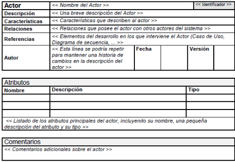
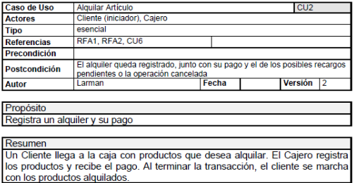
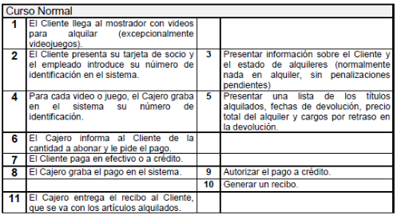
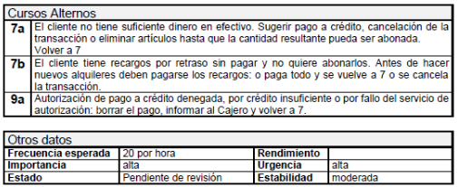
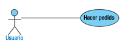
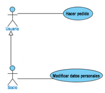
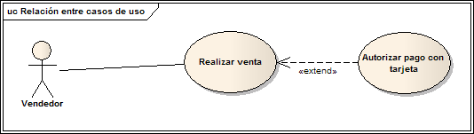
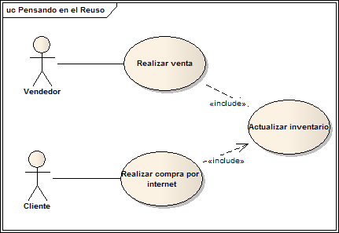

# UML

UML (Unified Modeling Language o Lenguaje Unificado de Modelado) es un conjunto de herramientas que permite modelar, construir y documentar los elementos que forman un sistema software orientado a objetos. Se ha convertido en el estándar de facto de la industria, debido a que ha sido concebido por los autores de los tres métodos más usados de orientación a objetos: Grady Booch, Ivar Jacobson y Jim Rumbaugh, de hecho las raíces técnicas de UML son:

+ OMT - Object Modeling Technique (Rumbaugh et al.)
+ Método-Booch (G. Booch)
+ OOSE - Object-Oriented Software Engineering (I. Jacobson)

¿Porqué es útil modelar?

+ Porque permite utilizar un lenguaje común que facilita la comunicación entre el equipo de desarrollo.
+ Con UML podemos documentar todos los artefactos de un proceso de desarrollo (requisitos, arquitectura, pruebas, versiones,...) por lo que se dispone de documentación que trasciende al proyecto.
+ Hay estructuras que trascienden lo representable en un lenguaje de programación, como las que hacen referencia a la arquitectura del sistema, utilizando estas tecnologías podemos incluso indicar qué módulos de software vamos a desarrollar y sus relaciones, o en qué nodos hardware se ejecutarán cuando trabajamos con sistemas distribuidos.
+ Permite especificar todas las decisiones de análisis, diseño e implementación, construyéndose modelos precisos, no ambiguos y completos.

> UML permite a los desarrolladores y desarrolladoras visualizar el producto de su trabajo en esquemas o diagramas estandarizados denominados modelos que representan el sistema desde diferentes perspectivas.

**Modelo**

Representación gráfica o esquemática de una realidad, sirve para organizar y comunicar de forma clara los elementos que involucran un todo. Esquema teórico de un sistema o de una realidad compleja que se elabora para facilitar su comprensión y el estudio de su comportamiento.

## Tipos de diagramas

UML define un sistema como una colección de modelos que describen sus diferentes perspectivas. Los modelos se implementan en una serie de diagramas que son representaciones gráficas de una colección de elementos de modelado, a menudo dibujado como un grafo conexo de arcos (relaciones) y vértices (otros elementos del modelo).

Un diagramas UML se compone de cuatro tipos de elementos:

+ **Estructuras:** Son los nodos del grafo y definen el tipo de diagrama.
+ **Relaciones:** Son los arcos del grafo que se establecen entre los elementos estructurales.
+ **Notas:** Se representan como un cuadro donde podemos escribir comentarios que nos ayuden a entender algún concepto que queramos representar.
+ **Agrupaciones:** Se utilizan cuando modelamos sistemas grandes para facilitar su desarrollo por bloques.

y se clasifican en:

+ **Diagramas estructurales:** Representan la visión estática del sistema. Especifican clases y objetos y como se distribuyen físicamente en el sistema.
+ **Diagramas de comportamiento:** muestran la conducta en tiempo de ejecución del sistema, tanto desde el punto de vista del sistema completo como de las instancias u objetos que lo integran. Dentro de este grupo están los diagramas de interacción.

En la imagen aparecen todos los diagramas organizados según su categoría. Se han destacado aquellos que perteneces al estándar UML 2.0, más novedosos. En total se describen trece diagramas para modelar diferentes aspectos de un sistema, sin embargo no es necesario usarlos todos, dependerá del tipo de aplicación a generar y del sistema, es decir, se debe generar un diagrama sólo si es necesario.

## Diagramas estructurales

Dentro de los diagramas estructurales, podemos destacar los siguientes tipos:

+ **Diagramas de clases:** Muestra los elementos del modelo estático abstracto, y está formado por un conjunto de clases y sus relaciones. Tiene una prioridad **ALTA**.
+ **Diagrama de objetos:** Muestra los elementos del modelo estático en un momento concreto, habitualmente en casos especiales de un diagrama de clases o de comunicaciones, y está formado por un conjunto de objetos y sus relaciones. Tiene una prioridad ALTA.
+ **Diagrama de componentes:** Especifican la organización lógica de la implementación de una aplicación, sistema o empresa, indicando sus componentes, sus interrelaciones, interacciones y sus interfaces públicas y las dependencias entre ellos. Tiene una prioridad **MEDIA**.
+ **Diagramas de despliegue:** Representan la configuración del sistema en tiempo de ejecución. Aparecen los nodos de procesamiento y sus componentes. Exhibe la ejecución de la arquitectura del sistema. Incluye nodos, ambientes operativos sea de hardware o software, así como las interfaces que las conectan, es decir, muestra como los componentes de un sistema se distribuyen entre los ordenadores que los ejecutan. Se utiliza cuando tenemos sistemas distribuidos. Tiene una prioridad **MEDIA**.
+ **Diagrama integrado de estructura (UML 2.0):** Muestra la estructura interna de una clasificación (tales como una clase, componente o caso típico), e incluye los puntos de interacción de esta clasificación con otras partes del sistema. Tiene una prioridad **BAJA**.
+ **Diagrama de paquetes:** Exhibe cómo los elementos del modelo se organizan en paquetes, así como las dependencias entre esos paquetes. Suele ser útil para la gestión de sistemas de mediano o gran tamaño. Tiene una prioridad **BAJA**.

### Diagramas de clases

Dentro de los diagramas estructurales, y de todos en general, es el más importante porque representa los elementos estáticos del sistema, sus atributos y comportamientos, y como se relacionan entre ellos. Contiene las clases del dominio del problema, y a partir de éste se obtendrán las clases que formarán después el programa informático que dará solución al problema.

En un diagrama de clases podemos encontrar los siguientes elementos:

+ **Clases**: recordemos que son abstracciones del dominio del sistema que representan elementos del mismo mediante una serie de características, que llamaremos atributos, y su comportamiento, que serán métodos. Los atributos y métodos tendrán una visibilidad que determinará quien puede acceder al atributo o método. Por ejemplo una clase puede representar a un coche, sus atributos serán la cilindrada, la potencia y la velocidad, y tendrá dos métodos, uno para acelerar, que subirá la velocidad, y otro para frenar que la bajará.
+ **Relaciones**: en el diagrama representan relaciones reales entre los elementos del sistema a los que hacen referencia las clases. Pueden ser de asociación, agregación y herencia. Por ejemplo si tengo una clase persona, puedo establecer una relación conduce entre persona y coche.
+ **Notas**: Se representan como un cuadro donde podemos escribir comentarios que nos ayuden a entender algún concepto que queramos representar.
+ **Elementos de agrupación**: Se utilizan cuando hay que modelar un sistema grande, entonces las clases y sus relaciones se agrupan en paquetes, que a su vez se relacionan entre sí.

#### Creación de clases

Una clase se representa en el diagrama como un rectángulo divido en tres filas, arriba aparece el nombre de la clase, a continuación los atributos con su visibilidad y después los métodos con su visibilidad que está representada por el signo menos "–" para los atributos (privados), por el signo más "+" para los métodos (públicos), por el signo "#" para los métodos protegidos y, por último, el signo "~" para paquetes.

#### Atributos

Forman la parte estática de la clase. Son un conjunto de variables para las que es preciso definir:

+ Su nombre.
+ Su tipo, puede ser un tipo simple, que coincidirá con el tipo de dato que se seleccione en el lenguaje de programación final a usar, o compuesto, pudiendo incluir otra clase.

Además se pueden indicar otros datos como un valor inicial o su visibilidad. La visibilidad de un atributo se puede definir como:

+ Público: Se pueden acceder desde cualquier clase y cualquier parte del programa.
+ Privado: Sólo se pueden acceder desde operaciones de la clase.
+ Protegido: Sólo se pueden acceder desde operaciones de la clase o de clases derivadas en cualquier nivel.
+ Paquete: Se puede acceder desde las operaciones de las clases que pertenecen al mismo paquete que la clase que estamos definiendo. Se usa cuando el lenguaje de implementación es Java.

#### Ejercicio 1

Crea una clase llamada Módulo que tenga 3 atributos: *Nombre* (str), *Duración* (int) y *Contenidos* (str)

#### Métodos

Representan la funcionalidad de la clase, es decir, qué puede hacer. Para definir un método hay que indicar como mínimo su nombre, parámetros, el tipo que devuelve y su visibilidad. También se debe incluir una descripción del método que aparecerá en la documentación que se genere del proyecto. 

#### Ejercicio 2

Crea los métodos *matricular* y *asignarDuracion* en la clase creada previamente.

#### Relaciones entre clases

Se representan como una línea continua. Los mensajes "navegan" por las relaciones entre clases, es decir, los mensajes se envían entre objetos de clases relacionadas, normalmente en ambas direcciones, aunque a veces la definición del problema hace necesario que se navegue en una sola dirección, entonces la línea finaliza en punta de flecha.

La relaciones se caracterizan por su cardinalidad, que representa cuantos objetos de una clase se pueden involucrar en la relación, y pueden ser:

+ De herencia.
+ De composición.
+ De agregación.

Por supuesto, es posible crear también relaciones unarias, es decir de una clase consigo misma.

#### Ejercicio 3

Crea una clase alumno y establece una relación de asociación con Módulo.

#### Cardinalidad

Un concepto muy importante es la cardinalidad de una relación, representa cuantos objetos de una clase se van a relacionar con objetos de otra clase. En una relación hay dos cardinalidades, una para cada extremo de la relación y pueden tener los siguientes valores:

|Cardinalidad|Significado|
|:-:|:-:|
|1|Uno y sólo uno
|0..1|Cero o uno
|N..M|Desde N hasta M
|*|Varios
|0..*|Cero o varios
|1..*|Uno o varios (al menos uno)

#### Ejercicio 4

Crea una clase profesor y establece una relación con Módulo. Indica la cardinalidad para las 3 clases.

#### Agregación y Composición.

La **agregación** es una asociación binaria que representa una relación todo-parte (pertenece a, tiene un, es parte de). Los elementos parte pueden existir sin el elemento contenedor y no son propiedad suya. Por ejemplo, un centro comercial tiene clientes o un equipo tiene unos miembros. El tiempo de vida de los objetos no tiene porqué coincidir. 

La **composición** es una agregación fuerte en la que una instancia 'parte' está relacionada, como máximo, con una instancia 'todo' en un momento dado, de forma que cuando un objeto 'todo' es eliminado, también son eliminados sus objetos 'parte'. Por ejemplo: un rectángulo tiene cuatro vértices, un centro comercial está organizado mediante un conjunto de secciones de venta... 

#### Atributos de enlace

Es posible que tengamos alguna relación en la que sea necesario añadir algún tipo de información que la complete de alguna manera. Cuando esto ocurre podemos añadir atributos a la relación. 

#### Ejercicio 5

Especifica en la relación entre Alumno y Modulo el curso al que pertenece la matricula y las notas obtenidas durante el curso. 

### Como pasar los requisitos de un sistema a un Diagrama de Clases

Empezamos identificando objetos que serán las clases del diagrama examinando el planteamiento del problema. Los objetos se determinan subrayando cada nombre o cláusula nominal e introduciéndola en una tabla simple. Los sinónimos deben destacarse. Pero, ¿qué debemos buscar una vez que se han aislado todos los nombres? Buscamos sustantivos que puedan corresponder con las siguientes categorías:

+ **Entidades externas** (por ejemplo: otros sistemas, dispositivos, personas) que producen o consumen información a usar por un sistema computacional.
+ **Elementos** (por ejemplo: informes, presentaciones, cartas, señales) que son parte del dominio de información del problema.
+ **Ocurrencias o sucesos** (por ejemplo: una transferencia de propiedad o la terminación de una serie de movimientos en un robot) que ocurren dentro del contexto de una operación del sistema.
+ **Papeles o roles** (por ejemplo: director, ingeniero, vendedor) desempeñados por personas que interactúan con el sistema.
+ **Unidades organizacionales** (por ejemplo: división, grupo, equipo) que son relevantes en una aplicación.
+ **Lugares** (por ejemplo: planta de producción o muelle de carga) que establecen el contexto del problema y la función general del sistema.
+ **Estructuras** (por ejemplo: sensores, vehículos de cuatro ruedas u ordenadores) que definen una clase de objetos o, en casos extremos, clases relacionadas de objetos.

Cuando estemos realizando este proceso debemos estar pendientes de no incluir en la lista cosas que no sean objetos, como operaciones aplicadas a otro objeto, por ejemplo, "inversión de imagen" producirá un objeto en el ámbito del problema, pero en la implementación dará origen a un método. También es posible detectar dentro de los sustantivos atributos de objetos, cosa que también indicaremos en la tabla.

Cuando tengamos la lista completa habrá que estudiar cada objeto potencial para ver si, finalmente, es incluido en el diagrama. Para ayudarnos a decidir podemos utilizar los siguientes criterios:

+ La información del objeto es necesaria para que el sistema funcione.
+ El objeto posee un **conjunto de atributos** que podemos encontrar en cualquier ocurrencia del objeto. Si sólo aparece un atributo normalmente se rechazará y será añadido como atributo de otro objeto.
+ El objeto tiene un **conjunto de operaciones** identificables que pueden cambiar el valor de sus atributos y son comunes a cualquier ocurrencia del objeto.
+ Es una entidad externa que consume o produce información esencial para la producción de cualquier solución en el sistema.

El objeto se incluye si cumple todos (o casi todos) los criterios.

#### Atributos

Definen al objeto en el contexto del sistema, es decir, el mismo objeto en sistemas diferentes tendría diferentes atributos, por lo que debemos buscar en el enunciado o en nuestro propio conocimiento, características que tengan sentido para el objeto en el contexto que se analiza. Deben contestar a la pregunta *"¿Qué elementos (compuestos y/o simples) definen completamente al objeto en el contexto del problema actual?"*

#### Operaciones

Describen el comportamiento del objeto y modifican sus características de alguna de estas formas:

+ Manipulan los datos.
+ Realizan algún cálculo.
+ Monitorizan un objeto frente a la ocurrencia de un suceso de control.

Se obtienen analizando verbos en el enunciado del problema.

#### Relaciones

Por último habrá que estudiar de nuevo el enunciado para obtener cómo los objetos que finalmente hemos descrito se relacionan entre sí. Para facilitar el trabajo podemos buscar mensajes que se pasen entre objetos y las relaciones de composición y agregación. Las relaciones de herencia se suelen encontrar al comparar objetos semejantes entre sí, y constatar que tengan atributos y métodos comunes.

Cuando se ha realizado este procedimiento no está todo el trabajo hecho, es necesario revisar el diagrama obtenido y ver si todo cumple con las especificaciones. No obstante siempre se puede refinar el diagrama completando aspectos del ámbito del problema que no aparezcan en la descripción recurriendo a entrevistas con los clientes o a nuestros conocimientos de la materia. 

## Diagramas de comportamiento

En los puntos anteriores hemos visto como crear un diagrama de clases para un problema determinado, esto nos ayuda a ver el problema con otra perspectiva y descubrir información nueva, sin embargo no tiene en cuenta elementos como la creación y destrucción de objetos, el paso de mensajes entre ellos y el orden en que deben hacerse, qué funcionalidad espera un usuario poder realizar, o como influyen elementos externos en nuestro sistema. Un diagrama de clases nos da información estática pero no dice nada acerca del comportamiento dinámico de los objetos que lo forman, para incluir éste tipo de información utilizamos los diagramas de comportamiento que incluyen:

+ Diagramas de casos de uso.
+ Diagramas de actividad.
+ Diagramas de máquinas de estado.
+ Diagramas de interacción.
    + Diagramas de secuencia.
    + Diagramas de comunicación.
    + Diagramas de interacción.
    + Diagramas de tiempo.

### Diagramas de casos de uso

Los diagramas de casos de uso son un elemento fundamental del análisis de un sistema desde la perspectiva de la orientación a objetos porque resuelven uno de los principales problemas en los que se ve envuelto el proceso de producción de software: la falta de comunicación entre el equipo de desarrollo y el equipo que necesita de una solución software. Un diagrama de casos de uso nos ayuda a determinar QUÉ puede hacer cada tipo diferente de usuario con el sistema, en una forma que los no versados en el mundo de la informática o, más concretamente el desarrollo de software, pueda entender.

Los diagramas de casos de uso documentan el comportamiento de un sistema desde el punto de vista del usuario. Por lo tanto los casos de uso determinan los **requisitos funcionales** del sistema, es decir, representan las funciones que un sistema puede ejecutar.

Un diagrama de casos de uso es una visualización gráfica de los requisitos funcionales del sistema, que está formado por casos de uso (se representan como elipses) y los actores que interactúan con ellos (se representan como monigotes). Su principal función es dirigir el proceso de creación del software, definiendo qué se espera de él, y su ventaja principal es la facilidad para interpretarlos, lo que hace que sean especialmente útiles en la comunicación con el cliente.

>*Recuerda*
>
>**Requisito funcional**
>
>Un requisito es una condición que debe cumplir un proyecto software. Los requisitos funcionales definen las acciones fundamentales que debe realizar el software al recibir información, procesarla y producir resultados. Suelen venir definidos por el cliente.

#### Actores

>Los **actores** representan un tipo de usuario del sistema. Se entiende como usuario cualquier cosa externa que interactúa con el sistema. No tiene por qué ser un ser humano, puede ser otro sistema informático o unidades organizativas o empresas. 

Siempre hay que intentar independizar los actores de la forma en que se interactúa con el sistema. Por ejemplo, un usuario del sistema puede interpretar diferentes roles según la operación que esté ejecutando, cada uno de estos roles representará un actor diferente, es decir, un actor en un diagrama de casos de uso representa un rol que alguien puede estar jugando, no un individuo particular por lo tanto puede haber personas particulares que puedan estar usando el sistema de formas diferentes en diferentes ocasiones. Suele ser útil mantener una lista de los usuarios reales para cada actor.

Tipos de actores:

+ **Primarios**: interaccionan con el sistema para explotar su funcionalidad. Trabajan directa y frecuentemente con el software.
+ **Secundarios**: soporte del sistema para que los primarios puedan trabajar. Son precisos para alcanzar algún objetivo.
+ **Iniciadores**: no interactúan con el sistema pero desencadenan el trabajo de otro actor.

Los actores se representan mediante la siguiente figura:

Es posible que haya casos de uso que no sean iniciados por ningún usuario, o algún otro elemento software, en ese caso se puede crear un actor "Tiempo" o "Sistema".

#### Casos de uso 

 Se utilizan casos de uso para especificar tareas que deben poder llevarse a cabo con el apoyo del sistema que se está desarrollando.

Un caso de uso especifica una secuencia de acciones, incluyendo variantes, que el sistema puede llevar a cabo, y que producen un resultado observable de valor para un actor concreto. El conjunto de casos de uso forma el "comportamiento requerido" de un sistema.

El objetivo principal de elaborar un diagrama de casos de uso no es crear el diagrama en sí, sino la descripción que de cada caso se debe realizar, ya que esto es lo que ayuda al equipo de desarrollo a crear el sistema a posteriori. Para hacer esto utilizamos, sobre todo otros diagramas que permiten describir la dinámica del caso de uso, como el diagrama de secuencia que veremos después, y una descripción textual, en la que se deben incluir, al menos, los siguientes datos (a los que se denomina contrato):

+ **Nombre**: nombre del caso de uso.
+ **Actores**: aquellos que interactúan con el sistema a través del caso de uso.
+ **Propósito**: breve descripción de lo que se espera que haga.
+ **Precondiciones**: aquellas que deben cumplirse para que pueda llevarse a cabo el caso de uso.
+ **Flujo normal**: flujo normal de eventos que deben cumplirse para ejecutar el caso de uso exitosamente, desde el punto de vista del actor que participa y del sistema.
+ **Flujo alternativo**: flujo de eventos que se llevan a cabo cuando se producen casos inesperados o poco frecuentes. No se deben incluir aquí errores como escribir un tipo de dato incorrecto o la omisión de un parámetro necesario.
+ **Postcondiciones**: las que se cumplen una vez que se ha realizado el caso de uso.

#### Relaciones

Los diagramas de casos de uso son grafos no conexos en los que los nodos son actores y casos de uso, y las aristas son las relaciones que existen entre ellos. Representan qué actores realizan las tareas descritas en los casos de uso, en concreto qué actores inician un caso de uso. Pero además existen otros tipos de relaciones que se utilizan para especificar relaciones más complejas, como uso o herencia entre casos de uso o actores.

Existen diferentes tipos de relaciones entre elementos:

+ **Asociación**: representa la relación entre el actor que lo inicia y el caso de uso.
+ **Inclusión**: se utiliza cuando queremos dividir una tarea de mayor envergadura en otras más sencillas, que son utilizadas por la primera. Representa una relación de uso, y son muy útiles cuando es necesario reutilizar tareas.
+ **Extensión**: se utiliza para representar relaciones entre un caso de uso que requiere la ejecución de otro en determinadas circunstancias.
+ **Generalización**: se utiliza para representar relaciones de herencia entre casos de uso o actores.

**Asociación o interacción**

Hay una asociación entre un actor y un caso de uso si el actor interactúa con el sistema para llevar a cabo el caso de uso o para iniciarlo.

Una asociación se representa mediante un linea continua que une un actor con un caso de uso. Por ejemplo, un usuario de un sistema de venta por Internet puede hacer un pedido, lo que se representa del siguiente modo: 

**Generalización**

 Es posible que, igual que con los diagramas de clases, existan casos de uso que tengan comportamientos semejantes a otros que los modifican o completan de alguna manera. El caso base se define de forma abstracta y los hijos heredan sus características añadiendo sus propios pasos o modificando alguno. Normalmente la herencia se utiliza menos en diagramas de casos de uso que en diagramas de clases.

Por ejemplo, el usuario del sistema de venta por Internet puede a su vez darse de alta en la página web para que tengan sus datos registrados a la hora de hacer el pedido, en este caso el usuario es la generalización del socio. Ambos actores pueden hacer un pedido, pero solo el socio puede modificar sus datos en el sistema. 

**Extensión**

 Se utiliza una relación entre dos casos de uso de tipo "extends" cuando se desea especificar que el comportamiento de un caso de uso es diferente dependiendo de ciertas circunstancias.

La principal función de esta relación es simplificar el flujo de casos de uso complejos. Se utiliza cuando existe una parte del caso de uso que se ejecuta sólo en determinadas ocasiones, pero no es imprescindible para su completa ejecución. Cuando un caso de uso extendido se ejecuta, se indica en la especificación del caso de uso como un punto de extensión. Los puntos de extensión se pueden mostrar en el diagrama de casos de uso.

Por ejemplo, cuando un usuario hace un pedido si no es socio se le ofrece la posibilidad de darse de alta en el sistema en ese momento, pero puede realizar el pedido aunque no lo sea. 

**Inclusión**

>Se incluye una relación entre dos casos de uso de tipo **"include"** cuando la ejecución del caso de uso incluido se da en la rutina normal del caso que lo incluye.

Esta relación es muy útil cuando se desea especificar algún comportamiento común en dos o más casos de uso, aunque es frecuente cometer el error de utilizar esta técnica para hacer subdivisión de funciones, por lo que se debe tener mucho cuidado cuando se utilice.

Por ejemplo, a la hora de hacer un pedido se debe buscar la información de los artículos para obtener el precio, es un proceso que necesariamente forma parte del caso de uso, sin embargo también forma parte de otros, como son el que visualiza el catálogo de productos y la búsqueda de un artículo concreto, y dado que tiene entidad por sí solo se separa del resto de casos de uso y se incluye en los otros tres.

Las ventajas de esta asociación son:

+ Las descripciones de los casos de uso son más cortas y se entienden mejor.
+ La identificación de funcionalidad común puede ayudar a descubrir el posible uso de componentes ya existentes en la implementación.

Las desventajas son:

+ La inclusión de estas relaciones hace que los diagramas sean más difíciles de leer, sobre todo para los clientes.

>Cuando usamos relaciones de inclusión o extensión no podemos olvidar que los casos de uso extendidos o incluidos deben cumplir con las características propias de un caso de uso, es decir, deben representar un flujo de actividad completo desde el punto de vista de lo que un actor espera que el sistema haga por él, así como no utilizar estas herramientas sólo para descomponer un caso de uso de envergadura en otros más pequeños, piedra angular del diseño estructurado y no del orientado a objetos.

### Ejercicio

Dado un sistema de pedidos a restaurantes, se pide realizar un diagrama de casos de uso que refleje el siguiente comportamiento.

+ El cliente puede buscar una comida
+ El cliente puede solicitar un encargo a un restaurante
+ Se necesita una cuenta de usuario para solicitar encargos.
+ Un restaurante puede ver los pedidos que tiene pendientes.

### Ejercicio 2

Dado un sistema de una tienda de videojuegos online, se pide realizar un diagrama de casos de uso que refleje el siguiente comportamiento.

- Buscar videojuegos. La búsqueda podrá ser modificada en función a las siguientes categorías:

    - RPG
    - Terror
    - Acción

- Comprar un juego concreto
- La compra de un juego tendrá un proceso de validación.
- Todas las compras tendrán que estar reflejadas en una base de datos.

